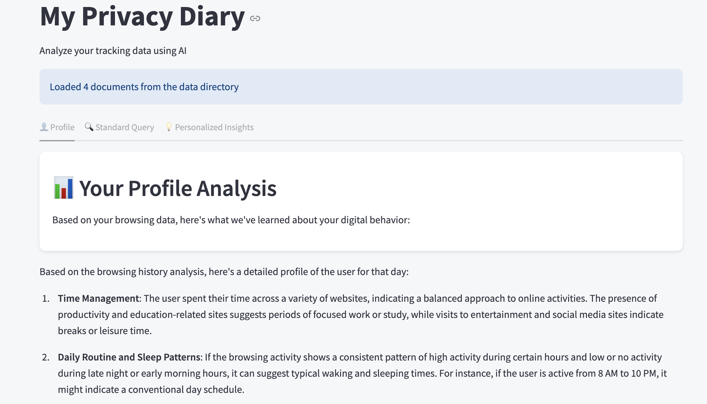

# My Privacy Diary

## Overview

Submission for the 3/15/2025 Seattle AI OSS Hackathon.

Team - Vish Subramanian, Thibaud Maudry, Skylar Deture

(we didn't win but hey , every line of code written was a step towards mastery, and every bug fixed was a lesson in patience :D)

My Privacy Diary is an AI-powered privacy analytics tool that transforms your browsing data into meaningful insights about your digital behavior. Using advanced LLM technology (GPT-4o), it analyzes your browsing patterns to provide personalized recommendations and insights.

## Features

- **Psychological Profiling**: Understand your digital behavior patterns and habits
- **Dual Analysis Modes**: 
  - Standard Query: Objective analysis of your browsing data
  - Personalized Insights: Tailored recommendations that speak directly to you
- **Privacy-Focused**: All data stays local - your privacy remains in your control
- **Interactive UI**: Easy-to-use interface with suggested questions and data visualization

## Getting Started

1. Clone this repository
2. Install dependencies: `pip install -r requirements.txt`
3. Set up your OpenAI API key in a `.env` file
4. Run the application: `streamlit run tracker-analyzer/agent.py`
5. Load your browsing data and explore your digital profile

## How It Works

My Privacy Diary uses LlamaIndex to create a searchable vector database from your browsing history. It then employs two AI agents powered by GPT-4o:
- A standard agent for objective data analysis
- A context-aware agent that incorporates your psychological profile into its responses

## Requirements

- Python 3.8+
- OpenAI API key
- Streamlit
- LlamaIndex
- dotenv

## Privacy Statement

My Privacy Diary is designed with privacy as a core principle. All data processing happens locally on your machine, and no browsing data is sent to external servers beyond the necessary API calls to OpenAI for analysis.

## License

MIT
